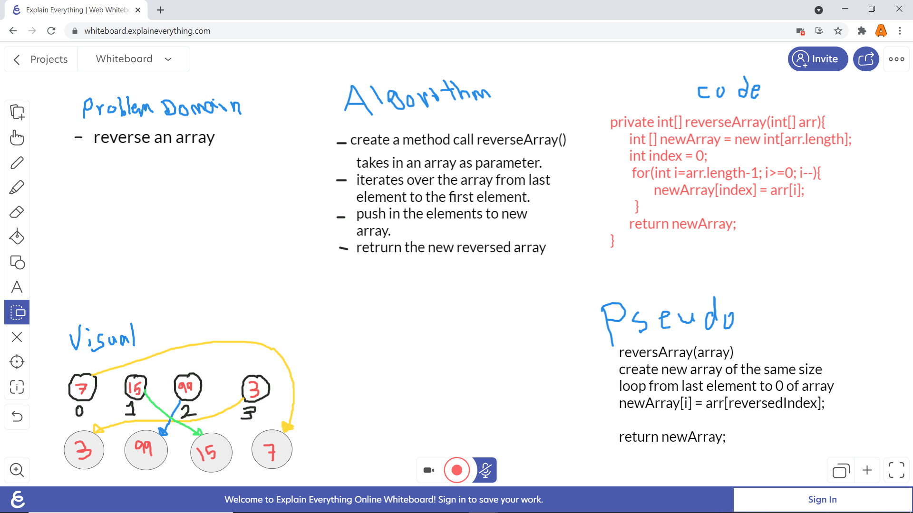

# 401 Data Structures, Code Challenges
### Challenge_01 reverse array

reverseArray(int [] arr) method that takes in an array and reverse its element and return reversed array.

This is the white borad of the problem that need to solve

