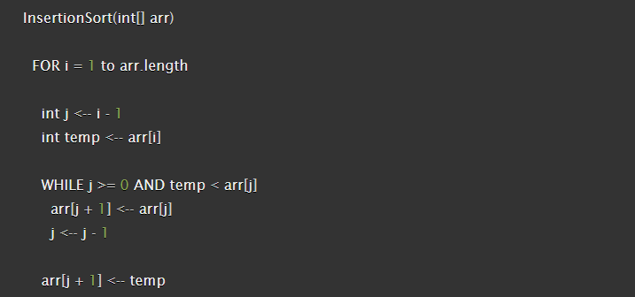
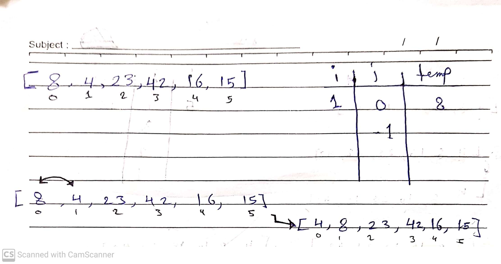
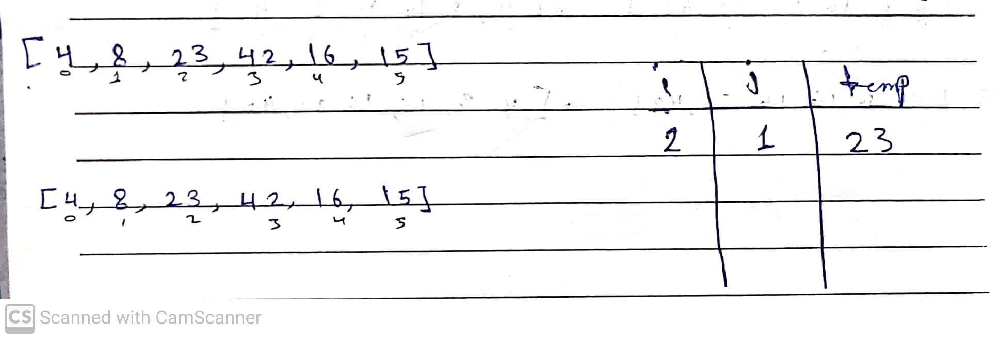
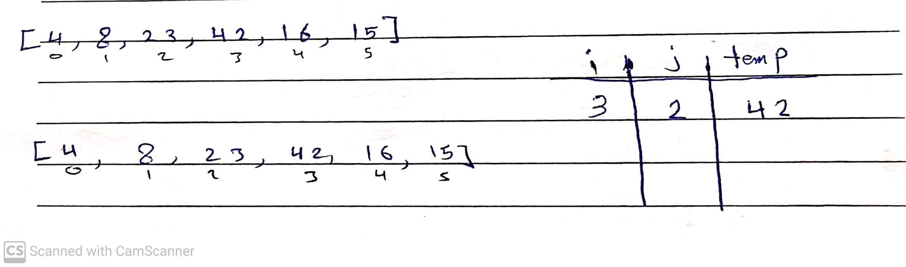
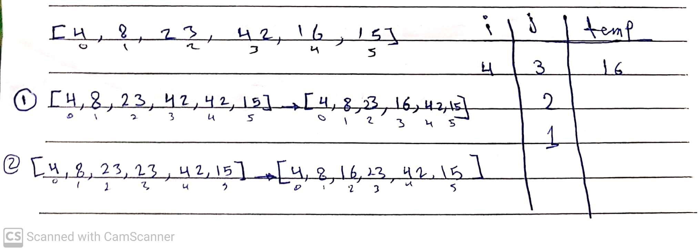
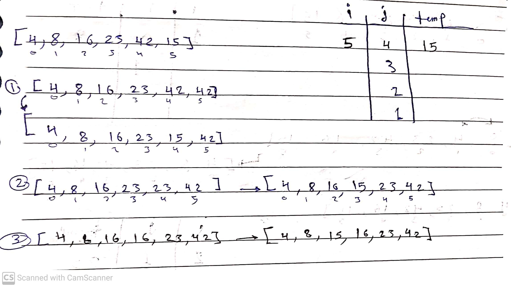

# Insertion Sort

[Insertion Sort](https://en.wikipedia.org/wiki/Insertion_sort) is a simple sorting algorithm that builds the final sorted array (or list) one item at a time. It is much less efficient on large lists than more advanced algorithms such as quicksort, heapsort, or merge sort.

## Pseudocode

## Trace

Sample Array: `[8,4,23,42,16,15]`

**Pass 1**:

In the first pass through of the insertion sort, we check if the second (*4*) item is less than the first item(*8*), which is true, so we swap these values, so the array becomes: `[4,8,23,42,16,15]`

**Pass 2**:

The second pass through the array we check if the value of the third item (*23*) is less than the second item (*8*), which is false, so the items are sorted till now.

**Pass 3**:

The third pass through we check if the value of the fourth item (*42*) is less than the third item (*23*), which is false, so the items are sorted till now.

**Pass 4**:

The 4th pass through we check if the value of the fifth item (*16*) is less than the fourth item (*42*), which is true, so that we swap the values until the sub-array is sorted, so the array becomes: `[4,8,16,23,42,15]`
**Pass 5**:

The 5th pass through we check if the value of the sixth item (*15*) is less than the fourth item (*42*), which is true, so that we swap the values until the sub-array issorted, so the array becomes: `[4,8,15,16,23,42]`

## Efficency

- Time: O(n^2)
    - The basic operation of this algorithm is comparison. This will happen n * (n-1) number of times...concluding the algorithm to be n squared.
- Space: O(1)
  - No additional space is being created. This array is being sorted in place...keeping the space at constant O(1).
