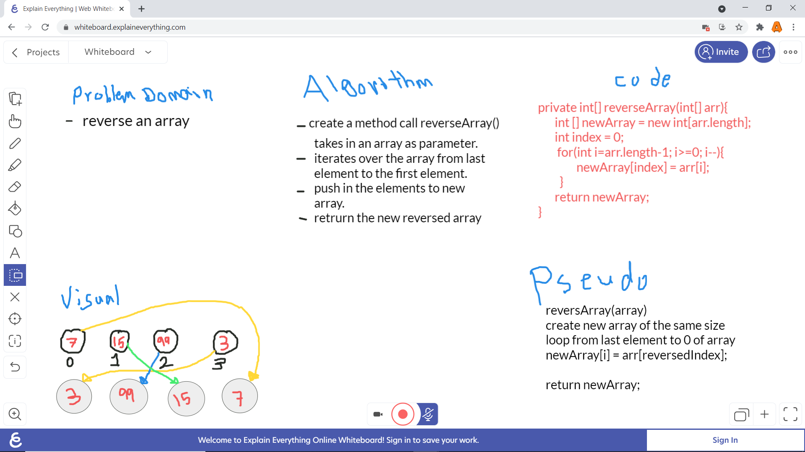
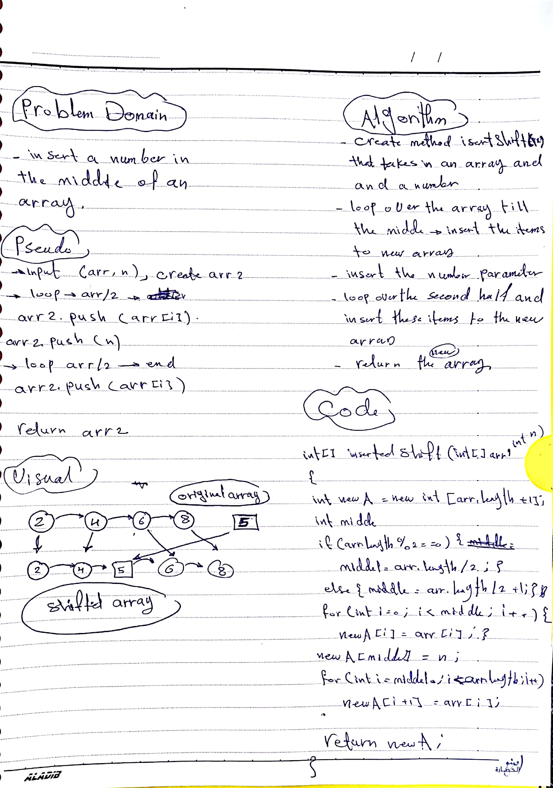
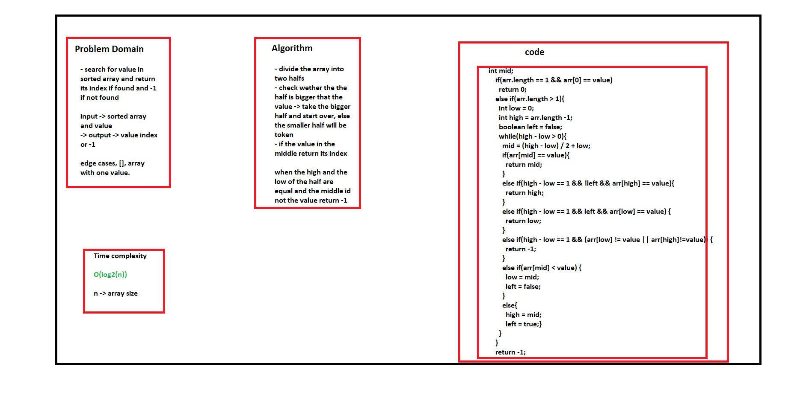
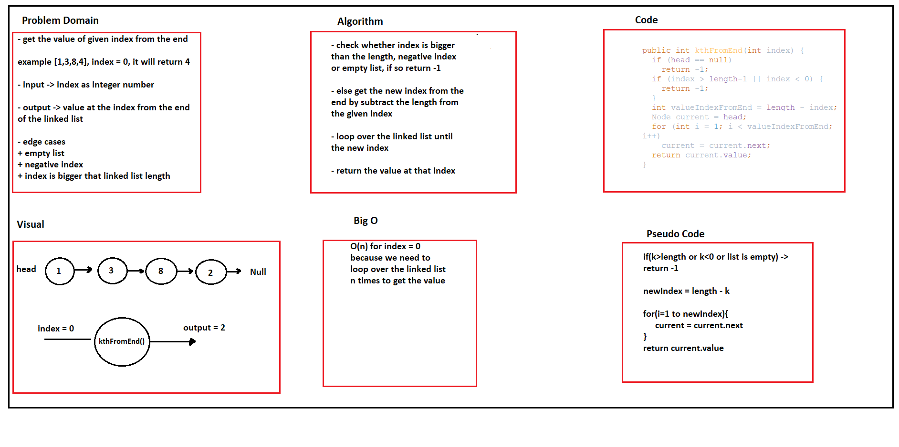
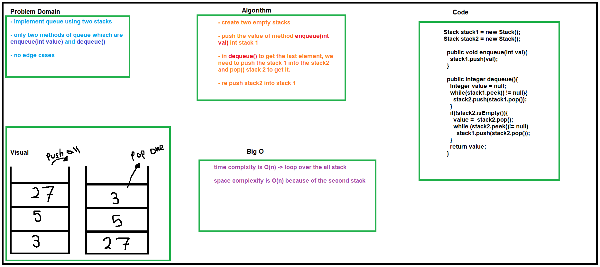

# Challenge_01 Summary
reverse an array [code](https://github.com/otator/data-structures-and-algorithms/blob/main/challenges/ArrayReverse.java)

## Challenge Description
reverseArray(int[] arr) method that takes in an array and reverse its element and return reversed array.

## Approach & Efficiency
iterating backward over the array, and pushing the original array elemenst to a new array.

time complexety: **O(n)**

## Solution

# Challenge_02 Summary
insert a number in the middle of an array [code](https://github.com/otator/data-structures-and-algorithms/blob/main/challenges/ArrayShift.java)

## Challenge Description
insertShiftArray(int[] arr, int n) method that takes in an array and a number and and insert the number in the array at the miidle

## Approach & Efficiency
iterate over the first half of the array and then add the items to a new array.

insert the number in the new array

iterate over the second half of the array and add its items to the new array and return that array.

time complexety: **O(n)**

## Solution

# Challenge_03 Summary
<!-- Short summary or background information -->
search for a value using binary search algorithm [code](https://github.com/otator/data-structures-and-algorithms/blob/main/challenges/codes/app/src/main/java/codes/BinarySearch.java)

## Challenge Description
<!-- Description of the challenge -->
`binarySearch(int[] arr, int value)` method that takes in sorted array and a value and search for the value in the array using binary search algorithm 

and if the value found, its index will be retuned and if the value is not in the array, the method will return -1

## Approach & Efficiency
<!-- What approach did you take? Why? What is the Big O space/time for this approach? -->
binary search algorith time complexity is **O(log2(n))**

## Solution
<!-- Embedded whiteboard image -->

 
# Singly Linked List
<!-- Short summary or background information -->
linked list unlike arrays itis the basic dynamic way to store data with the limit of the memory [code](https://github.com/otator/data-structures-and-algorithms/blob/main/challenges/codes/app/src/main/java/codes/app/src/main/java/codes/LinkedList.java)

## Challenge_05
<!-- Description of the challenge -->
create a dynamic list using classes. three methods **insert()**, **includes()**, and **toString()**. had been created.

## Approach & Efficiency
<!-- What approach did you take? Why? What is the Big O space/time for this approach? -->
- big o for `insert(int <n>)` is O(1)
- big o for `toString()` and `includes(int <n>)` is O(n);

## API
<!-- Description of each method publicly available to your Linked List -->
* `insert(int<n>)` takes in a integer number and insert it in the beggingin of the list at index 0.
* `includes(int <n>)`takes in an integer and return true if the number found in the list, else it will return false.
* `toString()` the printout the lineked list elements as: **{4} -> {20} -> {4} -> {5} ->  NULL**

# Challenge_6 Summary
Linked List Insertion is a challenge where we had to insert values in the beginning and at the end, before and after an element.

## Challenge Description
<!-- Description of the challenge -->
this challenge was about inserting new values at many positions depends on the following methods:
* `append(int <value>)` method that takes in a _value_ and append it at the end of the linked list.
* `insertBefore(int <value>, int <newValue>)` method that inserts _newValue_ immediately before the first _value_.
* `insertAfter(int<value>, int <newValue>)` method that inserts _newValue_ immediately after the first _value_
* `delete(int <value>)` method that deletes _value_ from the list.
All the above methods has been tested in the [AppTest.java](challenges/codes/AppTest.java)

## Approach & Efficiency
<!-- What approach did you take? Why? What is the Big O space/time for this approach? -->
* big o for `append(int <value>)`, `insertBefore(int <value>, int <newValue>)`, `insertAfter(int<value>, int <newValue>)`, and `delete(int <value>)` are O(n)

## Solution
<!-- Embedded whiteboard image -->

# Challenge_07 Summary
<!-- Short summary or background information -->
find the value at given index from the end

## Challenge Description
<!-- Description of the challenge -->
`kthFromEnd(int <index>)` method that loops over the list until meets the index and return the value at that index.

## Approach & Efficiency
<!-- What approach did you take? Why? What is the Big O space/time for this approach? -->
time complexity is **O(n)** for the worst case, if the passed index is 0 needs to loop over all the array items to get its value

## Solution
<!-- Embedded whiteboard image -->

# Challenge_8 Summary
<!-- Short summary or background information -->
zip two linked list 
list1: {1} -> {3} -> {2} -> NULL
list2: {5} -> {9} -> {4} -> NULL
after calling the function FullLinkedList.zip(list1, list2)
output: {1} -> {5} -> {3} -> {9} -> {2} -> {4} -> NULL

## Challenge Description
<!-- Description of the challenge -->
a static method called `zip(FullLinkedList list1, FullLinkedList list2)` created to zip(merge) two linked lists in one linked list

## Approach & Efficiency
<!-- What approach did you take? Why? What is the Big O space/time for this approach? -->
space complexity **O(1)** and time complexity is **O(n)**

## Solution
<!-- Embedded whiteboard image -->

# Stacks and Queues
<!-- Short summary or background information -->
impelementing stack and queue data structures
* stack principle is the last element entered will be that first element to go out (LIFO)
* queue principle is the first element entered will be the first element to go out (FIFO)

## Challenge
<!-- Description of the challenge -->
Classes 
1. [Stack.java](challenges/satcks_and_queues/app/src/main/java/satcks_and_queues/Stack.java) class.
2. [Queue.java](challenges/satcks_and_queues/app/src/main/java/satcks_and_queues/Queue.java) class
3. [Node.java](challenges/satcks_and_queues/app/src/main/java/satcks_and_queues/Node.java) class
4. [AppTest.java](challenges/satcks_and_queues/app/src/test/java/satcks_and_queues/AppTest.java) for testing the above classes methods.

in Stack.java the following method implemeted:
* `push(int <value>)` pushes a value to the top of the stack
* `pop()` pops out the top element of the stack(and delete it from the stack)
* `peek()` view the top element of the stack
* `isEmpty()` checks wheter the stack is empty or not

in Queue.java the following method implemeted:
* `enqueue(int <value>)` enqueues a value to the rear of the queue
* `dequeue()` pops out the front element of the queue(and delete it from the queue)
* `peek()` view the front element of the queue
* `isEmpty()` checks wheter the queue is empty or not

in Node.java three fileds had been created to use in stack and queue implementaions
* int value -> the value of the node
* Node next -> a pointer that points to the next node in the stack/queue
* Node previous -> a pointer that points to the previous node in the stack/queue

in [AppTest.java](challenges/satcks_and_queues/app/src/test/java/satcks_and_queues/AppTest.java) class many methods had written to test the functionality of the Stack and Queue classes.

## Approach & Efficiency
<!-- What approach did you take? Why? What is the Big O space/time for this approach? -->
for stack -> all the methods time complexity is O(1) except `toString()` is O(n)
for queue -> all the methods time complexity is O(1) except `toString()` is O(n)

## API
<!-- Description of each method publicly available to your Stack and Queue-->
**_Stack.java_**
* `push(int <value>)` pushes a value to the top of the stack
* `pop()` pops out the top element of the stack(and delete it from the stack)
* `peek()` view the top element of the stack
* `isEmpty()` checks wheter the stack is empty or not

**_Queue.java_**
* `enqueue(int <value>)` enqueues a value to the rear of the queue
* `dequeue()` pops out the front element of the queue(and delete it from the queue)
* `peek()` view the front element of the queue
* `isEmpty()` checks wheter the queue is empty or not

# Challenge Summary
<!-- Short summary or background information -->
implement a queue using two stacks

## Challenge Description
<!-- Description of the challenge -->
using two instances of class [Stack.java](challenges/codes/app/src/main/stacksandqueues/Stack.java) to impelement queue.

in [PseudoQueue.java](challenges/codes/app/src/main/stacksandqueues/PseudoQueue.java) class queue structure had been implemented with the following methods:
* `enqueue(int <value>)` methods that takes in a value and push it to the first stack
* `dequeue()` method that get the first element that entered the first stack and this done as follow:
  * push the first stack contenet into the second class
  * pop the first element of the stack two which is the same element of stack one
  * after that, push stack two content into stack one.
  * this makes the two stacks performs as queue

in [AppTest.java](challenges/codes/AppTest.java) class the [PseudoQueue.java](challenges/codes/app/src/main/stacksandqueues/PseudoQueue.java) functionality had been tested

## Approach & Efficiency
<!-- What approach did you take? Why? What is the Big O space/time for this approach? -->
since we had to create a new stack to hold the others content temprory the space complexity was **O(n)**

the time complexity is **O(n)** because we are looping over the whole stack.

## Solution
<!-- Embedded whiteboard image -->

