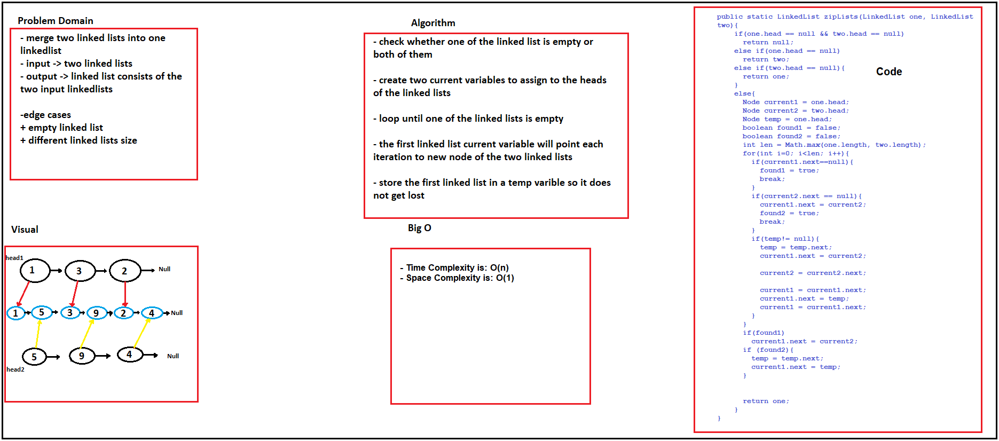

<style>
img{
  border-radius: 10px;
}
</style>


# Challenge_01 Summary
reverse an array [code](https://github.com/otator/data-structures-and-algorithms/blob/main/challenges/ArrayReverse.java)

## Challenge Description
reverseArray(int[] arr) method that takes in an array and reverse its element and return reversed array.

## Approach & Efficiency
iterating backward over the array, and pushing the original array elemenst to a new array.

time complexety: **O(n)**

## Solution


# Challenge_02 Summary
insert a number in the middle of an array [code](https://github.com/otator/data-structures-and-algorithms/blob/main/challenges/ArrayShift.java)

## Challenge Description
insertShiftArray(int[] arr, int n) method that takes in an array and a number and and insert the number in the array at the miidle

## Approach & Efficiency
iterate over the first half of the array and then add the items to a new array.

insert the number in the new array

iterate over the second half of the array and add its items to the new array and return that array.

time complexety: **O(n)**

## Solution


# Challenge_03 Summary
<!-- Short summary or background information -->
search for a value using binary search algorithm [code](https://github.com/otator/data-structures-and-algorithms/blob/main/challenges/codes/app/src/main/java/codes/BinarySearch.java)

## Challenge Description
<!-- Description of the challenge -->
`binarySearch(int[] arr, int value)` method that takes in sorted array and a value and search for the value in the array using binary search algorithm 

and if the value found, its index will be retuned and if the value is not in the array, the method will return -1


## Approach & Efficiency
<!-- What approach did you take? Why? What is the Big O space/time for this approach? -->
binary search algorith time complexity is **O(log2(n))**

## Solution
<!-- Embedded whiteboard image -->


 
# Singly Linked List
<!-- Short summary or background information -->
linked list unlike arrays itis the basic dynamic way to store data with the limit of the memory [code](https://github.com/otator/data-structures-and-algorithms/blob/main/challenges/codes/app/src/main/java/codes/app/src/main/java/codes/LinkedList.java)

## Challenge_05
<!-- Description of the challenge -->
create a dynamic list using classes. three methods **insert()**, **includes()**, and **toString()**. had been created.


## Approach & Efficiency
<!-- What approach did you take? Why? What is the Big O space/time for this approach? -->
- big o for `insert(int <n>)` is O(1)
- big o for `toString()` and `includes(int <n>)` is O(n);

## API
<!-- Description of each method publicly available to your Linked List -->
* `insert(int<n>)` takes in a integer number and insert it in the beggingin of the list at index 0.
* `includes(int <n>)`takes in an integer and return true if the number found in the list, else it will return false.
* `toString()` the printout the lineked list elements as: **{4} -> {20} -> {4} -> {5} ->  NULL**


# Challenge_6 Summary
Linked List Insertion is a challenge where we had to insert values in the beginning and at the end, before and after an element.

## Challenge Description
<!-- Description of the challenge -->
this challenge was about inserting new values at many positions depends on the following methods:
* `append(int <value>)` method that takes in a _value_ and append it at the end of the linked list.
* `insertBefore(int <value>, int <newValue>)` method that inserts _newValue_ immediately before the first _value_.
* `insertAfter(int<value>, int <newValue>)` method that inserts _newValue_ immediately after the first _value_
* `delete(int <value>)` method that deletes _value_ from the list.
All the above methods has been tested in the [AppTest.java](challenges/codes/AppTest.java)

## Approach & Efficiency
<!-- What approach did you take? Why? What is the Big O space/time for this approach? -->
* big o for `append(int <value>)`, `insertBefore(int <value>, int <newValue>)`, `insertAfter(int<value>, int <newValue>)`, and `delete(int <value>)` are O(n)

## Solution
<!-- Embedded whiteboard image -->


# Challenge_07 Summary
<!-- Short summary or background information -->
find the value at given index from the end

## Challenge Description
<!-- Description of the challenge -->
`kthFromEnd(int <index>)` method that loops over the list until meets the index and return the value at that index.

## Approach & Efficiency
<!-- What approach did you take? Why? What is the Big O space/time for this approach? -->
time complexity is **O(n)** for the worst case, if the passed index is 0 needs to loop over all the array items to get its value

## Solution
<!-- Embedded whiteboard image -->


# Challenge_8 Summary
<!-- Short summary or background information -->
zip two linked list 
list1: {1} -> {3} -> {2} -> NULL
list2: {5} -> {9} -> {4} -> NULL
after calling the function FullLinkedList.zip(list1, list2)
output: {1} -> {5} -> {3} -> {9} -> {2} -> {4} -> NULL

## Challenge Description
<!-- Description of the challenge -->
a static method called `zip(FullLinkedList list1, FullLinkedList list2)` created to zip(merge) two linked lists in one linked list

## Approach & Efficiency
<!-- What approach did you take? Why? What is the Big O space/time for this approach? -->
space complexity **O(1)** and time complexity is **O(n)**

## Solution
<!-- Embedded whiteboard image -->



# Stacks and Queues
<!-- Short summary or background information -->
impelementing stack and queue data structures
* stack principle is the last element entered will be that first element to go out (LIFO)
* queue principle is the first element entered will be the first element to go out (FIFO)

## Challenge
<!-- Description of the challenge -->
Classes 
1. [Stack.java](challenges/satcks_and_queues/app/src/main/java/satcks_and_queues/Stack.java) class.
2. [Queue.java](challenges/satcks_and_queues/app/src/main/java/satcks_and_queues/Queue.java) class
3. [Node.java](challenges/satcks_and_queues/app/src/main/java/satcks_and_queues/Node.java) class
4. [AppTest.java](challenges/satcks_and_queues/app/src/test/java/satcks_and_queues/AppTest.java) for testing the above classes methods.

in Stack.java the following method implemeted:
* `push(int <value>)` pushes a value to the top of the stack
* `pop()` pops out the top element of the stack(and delete it from the stack)
* `peek()` view the top element of the stack
* `isEmpty()` checks wheter the stack is empty or not

in Queue.java the following method implemeted:
* `enqueue(int <value>)` enqueues a value to the rear of the queue
* `dequeue()` pops out the front element of the queue(and delete it from the queue)
* `peek()` view the front element of the queue
* `isEmpty()` checks wheter the queue is empty or not

in Node.java three fileds had been created to use in stack and queue implementaions
* int value -> the value of the node
* Node next -> a pointer that points to the next node in the stack/queue
* Node previous -> a pointer that points to the previous node in the stack/queue

in [AppTest.java](challenges/satcks_and_queues/app/src/test/java/satcks_and_queues/AppTest.java) class many methods had written to test the functionality of the Stack and Queue classes.

## Approach & Efficiency
<!-- What approach did you take? Why? What is the Big O space/time for this approach? -->
for stack -> all the methods time complexity is O(1) except `toString()` is O(n)
for queue -> all the methods time complexity is O(1) except `toString()` is O(n)

## API
<!-- Description of each method publicly available to your Stack and Queue-->
**_Stack.java_**
* `push(int <value>)` pushes a value to the top of the stack
* `pop()` pops out the top element of the stack(and delete it from the stack)
* `peek()` view the top element of the stack
* `isEmpty()` checks wheter the stack is empty or not

**_Queue.java_**
* `enqueue(int <value>)` enqueues a value to the rear of the queue
* `dequeue()` pops out the front element of the queue(and delete it from the queue)
* `peek()` view the front element of the queue
* `isEmpty()` checks wheter the queue is empty or not


# Challenge_11 Summary
<!-- Short summary or background information -->
implement a queue using two stacks

## Challenge Description
<!-- Description of the challenge -->
using two instances of class [Stack.java](challenges/codes/app/src/main/stacksandqueues/Stack.java) to impelement queue.

in [PseudoQueue.java](challenges/codes/app/src/main/stacksandqueues/PseudoQueue.java) class queue structure had been implemented with the following methods:
* `enqueue(int <value>)` methods that takes in a value and push it to the first stack
* `dequeue()` method that get the first element that entered the first stack and this done as follow:
  * push the first stack contenet into the second class
  * pop the first element of the stack two which is the same element of stack one
  * after that, push stack two content into stack one.
  * this makes the two stacks performs as queue

in [AppTest.java](challenges/codes/AppTest.java) class the [PseudoQueue.java](challenges/codes/app/src/main/stacksandqueues/PseudoQueue.java) functionality had been tested

## Approach & Efficiency
<!-- What approach did you take? Why? What is the Big O space/time for this approach? -->
since we had to create a new stack to hold the others content temprory the space complexity was **O(n)**


the time complexity is **O(n)** because we are looping over the whole stack.

## Solution
<!-- Embedded whiteboard image -->


# Challenge_12 Summary
<!-- Short summary or background information -->
using a queue with First In First Out (**FIFO**) an animal shelter has been implemented

## Challenge Description
<!-- Description of the challenge -->
in class [AnimalShelter.java](challenges/codes/app/src/main/utilites/AnimalShelter.java) the following methods implemented:

* `enqueue(String <animal>)` this methods add cats and dogs only in the shelter
* `dequeue(String <animal>)` this method return a cat or dog from the shelter if found


## Approach & Efficiency
<!-- What approach did you take? Why? What is the Big O space/time for this approach? -->

* space complexity is O(1) => there is not new space allocated
* time complexity is O(n) => because of the looping over the all queue in the worst case.


## Solution
<!-- Embedded whiteboard image -->


# Challenge_13 Summary
<!-- Short summary or background information -->
check whether a string have a balanced brackets or not

## Challenge Description
<!-- Description of the challenge -->

in class [MultiBracketValidation.java](challenges/codes/app/src/main/utilites/MultiBracketValidation.java) a method called `multiBracketValidation` created to check if a string has balanced brackets or not

this method uses helper method that has been created within [Stack.java]((challenges/codes/app/src/main/utilites/Stack) named `popUntil(String <value>)`, this method pops all the values until meet the input value and pop it as well

## Approach & Efficiency
<!-- What approach did you take? Why? What is the Big O space/time for this approach? -->
time complexity is O(n) -> loop over the string
space complexity is O(n) -> create a stack to push the string in.

## Solution
<!-- Embedded whiteboard image -->


# Trees
<!-- Short summary or background information -->
A tree is a collection of nodes each node has a value and it is aware of its parent and its children nodes.

Each tree must have a root.

the path between nodes in tree called *edges* and it is the height of the tree.

the node that does not have any children called *leaf*

Binary Search Tree (BST) is a special type of trees where each node has only to nodes (left and right nodes), and it is used to for search becuase of the fast performance for its structure, where each time the half of the tree cancelled for the search which leads to time complexity **O(log2(N))**


## Challenge_15
<!-- Description of the challenge -->
implement a binary search tree

[Node](challenges/codes/app/src/main/tree/Node.java) class that has left, right nodes and a value choosen to be the node of the tree.

inside [Tree](challenges/codes/app/src/main/tree/Tree.java) class the three traversals has been implemented:
* Pre-order 
* In-order
* Post-order

all the three traversals used recursion to traverse over the tree.

class [BinarySearchTree](challenges/codes/app/src/main/tree/BinarySearchTree.java) inherits the tree class, and it has the `add(Integer <value>)` method

that adds a node to the tree.

and `isEmpty()` to check whether the tree is empty or not

`contains(Integer <value>, <tree.root> )` method that returns if the value exists in the tree or not


## Approach & Efficiency
<!-- What approach did you take? Why? What is the Big O space/time for this approach? -->

time complexity is **O(n)** for traversal because all the nodes will be visited

## API (Binary Search Tree)
<!-- Description of each method publicly available in each of your trees -->

* create an instsance of Binary Search Tree class

    `BinarySearchTree binarySearchTree = new BinarySearchTree();`

* add a node to the tree

    `binarySearchTree.add(Integer <value>);`

* for pre-order traversal call the method `preOrder` and pass it the tree root as an argument.

    `binarySearchTree.preOrder(binarySearchTree.root);`

    * to print the pre-order traversal

      `System.out.println(binarySearchTree.preOrderList);`

* for in-order traversal call the method `inOrder` and pass it the tree root as an argument.

    `binarySearchTree.inOrder(binarySearchTree.root);`

    * to print the in-order traversal

      `System.out.println(binarySearchTree.inOrderList);`

* for post-order traversal call the method `postOrder` and pass it the tree root as an argument.

    `binarySearchTree.postOrder(binarySearchTree.root);`

    * to print the post-order traversal

      `System.out.println(binarySearchTree.postOrderList);`

* check if the tree is empty

`binarySearchTree.isEmpty(); // returns true or false`

* check whether a tree contains a value

`binarySearchTree.contains(Integer <value>, binarySearchTree.root);`


# Challenge_16 Summary
<!-- Short summary or background information -->
find the maximum value of a binary tree

## Challenge Description
<!-- Description of the challenge -->
method `findMaximumValue(Node <root>)` will return the maximum value of the tree

at first the maximum is the root then traverse over the tree

the pre-order traversal used in this case to visit all the tree nodes

for each node, we compare the value of it with the maximum, if it is bigger then update the maximum value

until all the nodes are visited and then return the maximum value.


## Approach & Efficiency
<!-- What approach did you take? Why? What is the Big O space/time for this approach? -->
time complexity is **O(n)** because all the nodes will be visited
space complexity is **O(1)** because searching for the max value in tree does not allocate extra space

## Solution
<!-- Embedded whiteboard image -->


# Challenge_17 Summary
<!-- Short summary or background information -->
travesre a binary search tree using breadth first traversal and print out its node values


## Challenge Description
<!-- Description of the challenge -->
for this challenge a [Queue](challenges/codes/app/src/main/tree/Queue.java) class used to hold the tree nodes.
`breadthFirst(Node <value>)` method that traverse over the tree using breadth first traversal.

to achive that a queue has been created and the tree node enqueued inside it.

to visit all the nodes, looping until the queue peak is empty was the soloution

each iteration the front is dequeued and check if it has left and right nodes

if it has a left node then enqueue it in the queue

if it has a right node then enqueue it as well.

print the value or add it inside an array list each time the front is dequeued to show to the result.

## Approach & Efficiency
<!-- What approach did you take? Why? What is the Big O space/time for this approach? -->
time complexity is **O(n)** because we are visting all the nodes in the tree
space complecity is **O(n)** because of creating a queue that holds the tree nodes

## Solution
<!-- Embedded whiteboard image -->


# Challenge_18 Summary
<!-- Short summary or background information -->
Fizz Buzz Tree is a tree that has the fizz value in each node that has a number is divisible by three

and the value 5 for each number divisible by 5

and if the number is divisible by both 3 and 5 the value fizzbuzz will be set.

## Challenge Description
<!-- Description of the challenge -->

[FizzBuzzTree.java](challenges/codes/app/src/main/utilites/FizzBuzzTree.java) class has been created to create an instance tree of it

to make the FizzBuzzTree instances have a string and numbers values a [TreeNode](challenges/codes/app/src/main/TreeNode.java) class with value of type Object has been created 

`fizzBuzzTree(TreeNode <root>)` method that takes in a tree and traverse over it using pre order traversal and check each node's value:

* if the value is divisible by 3 and 5 -> replace the value by "*FizzBuzz*"
* if the value is divisible by 3 -> replace the value by "*Fizz*"
* if the value is divisible by 5 -> replace the value by "*Buzz*"
* if the value is NOT divisible by 3 or 5 -> convert the value to *string*


## Approach & Efficiency
<!-- What approach did you take? Why? What is the Big O space/time for this approach? -->
time complexity is **O(n)** because we are visiting all the nodes

space complexity is **O(1)**, not extra space allocated

## Solution
<!-- Embedded whiteboard image -->


# Challenge_26

find the BLOG article about the challenge [here](BLOG.md)

find the code implementation of the code challenge [here](codes/app/src/main/sort/InsertionSort.java)

find the test of the code challenge [here](codes/app/src/main/sort/TestInsertion.java)


# Challenge_27

find the BLOG article about the challenge [here](blogs/merge-sort/BLOG.md)

find the code implementation of the code challenge [here](codes/app/src/main/sort/MergeSort.java)

find the test of the code challenge [here](codes/app/src/main/sort/TestMerge.java)


# Challenge_28

find the BLOG article about the challenge [here](blogs/quick-sort/BLOG.md)

find the code implementation of the code challenge [here](codes/app/src/main/sort/QuickSort.java)

find the test of the code challenge [here](codes/app/src/main/sort/TestQuick.java)


# challenge_30
<!-- Short summary or background information -->
Implementing hash table, hash table is a data strcuture where key-value pairs can be stored and retrieved.

## Challenge
<!-- Description of the challenge -->
implementing the hash table passed through the following:
* create a [Node](codes/app/src/main/hashtable/LinkedList.java) class that has String value and pointer to the next node.
* create [LinkedList.java](codes/app/src/main/hashtable/LinkedList.java) class, this classs needed to create the buckets for the hash table
* create [HashTable.java](codes/app/src/main/hashtable/HashTable.java) class, and it has the following:
  1. An array with an empty linked list at each index
  2. `getHash(String <key>)` method that returns an index after hashing a key.
  3. `add(String <key>, String <value>)` method that adds a key-value pair into the hash table.
  4. `find(String <key>)` method that returns the value of the given key if exists.
  5. `contains(String <key>)` method that checks whether a key exists in the hash table or not.
  6. `toString()` method that returns a string represeting the hash table in a specific format.

## Approach & Efficiency
<!-- What approach did you take? Why? What is the Big O space/time for this approach? -->

since adding and getting from an array has the time complexity of **O(1)**, the hash table has the same time complexity.

hashing a key and convert it to index has time complexity **O(1)** 

looping over a small linked list in case of collision has also **O(n)** as time complexity.


## API (Hash Table)
<!-- Description of each method publicly available in each of your hashtable -->

* create an instance of a hash table.

```java
  int size = 10; //the size of the hash table array
  HashTable hashTable = new HashTable(size);
```

* add key-value pair to the hash table.

```java
  hashTable.add("name", "AbdalQader");
```

* get the value of key if exists.

```java
  String name = hashTable.find("name"); // name = AbdalQader
  String age = hashTable.find("age"); // age = null
```

* check whether a key exists or not.

```java
  boolean found = hashTable.contains("name"); // found = true;
  boolean isFound = hashTable.contains("age"); // isFound = false;
```

* get the hash of a key.

  ```java
  int name = hashTable.getHash("name"); // name = 7 in case of array size is 10
  ```


## Challenge_31
<!-- Description of the challenge -->
find the first repeated word in a string

this challenge is done using hashtable where each word is added at a specific index

this index is generated using hash function.

each time a word is added, check if the index(bucket of nodes) has the word already

if so return the word because it is repeated.

## Whiteboard Process
<!-- Embedded whiteboard image -->


## Approach & Efficiency
<!-- What approach did you take? Why? What is the Big O space/time for this approach? -->
**space** complexity:

**O(n)** for creating new String array

**O(1)** for creating a hash table with fixed size

total = **O(n)**

**Time** Complexity

looping over the array of words -> **O(n)**

hashing words to get index and adding to hash table -> **O(1)**

total = **O(n)**


## Solution
<!-- Show how to run your code, and examples of it in action -->

find the code [here](codes/app/src/main/hashtable/RepeatedWord.java)

find the tests [here](codes/AppTest.java#L983)


