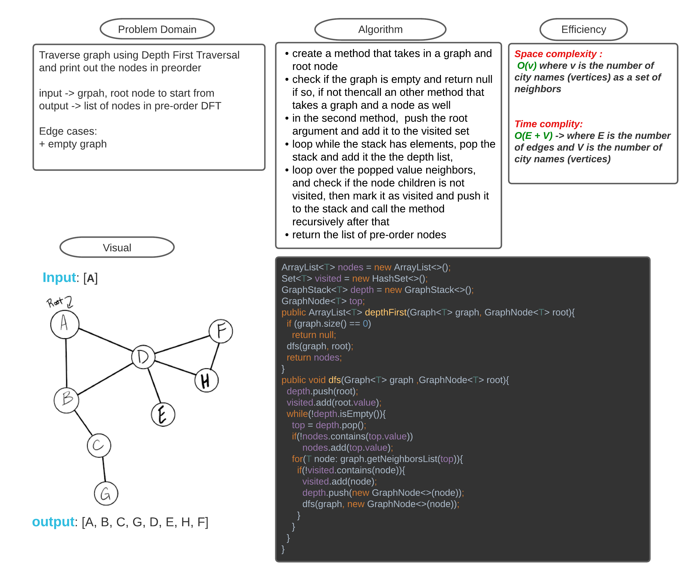

# Challenge Summary
<!-- Description of the challenge -->

Traverse graph using Depth First Traversal and print out the nodes in preorder

input -> grpah, root node to start from 
output -> list of nodes in pre-order DFT

Edge cases:
+ empty graph

## Whiteboard Process
<!-- Embedded whiteboard image -->

## Approach & Efficiency
<!-- What approach did you take? Why? What is the Big O space/time for this approach? -->

Space complexity : 
 O(v) where v is the number of  nodes (vertices) as a set of neighbors

Time complity:
O(E + V) -> where E is the number of edges and V is the number of nodes (vertices)

## Solution
<!-- Show how to run your code, and examples of it in action -->

find the code [here](DepthFirst.java)

run sample code [here](DepthFirstMain.java)

run tests [here](TestDepthFirst.java)
