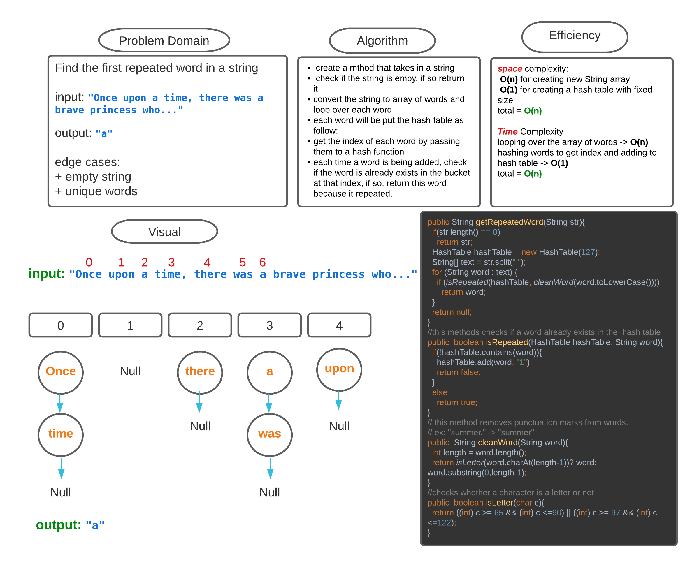

## Challenge_31
<!-- Description of the challenge -->
find the first repeated word in a string

this challenge is done using hashtable where each word is added at a specific index

this index is generated using hash function.

each time a word is added, check if the index(bucket of nodes) has the word already

if so return the word because it is repeated.

## Whiteboard Process
<!-- Embedded whiteboard image -->

## Approach & Efficiency
<!-- What approach did you take? Why? What is the Big O space/time for this approach? -->
**space** complexity:

**O(n)** for creating new String array

**O(1)** for creating a hash table with fixed size

total = **O(n)**

**Time** Complexity

looping over the array of words -> **O(n)**

hashing words to get index and adding to hash table -> **O(1)**

total = **O(n)**

## Solution
<!-- Show how to run your code, and examples of it in action -->

see and run sample the code [here](RepeatedWord.java)

run the tests [here](TestRepeatedWord.java)

