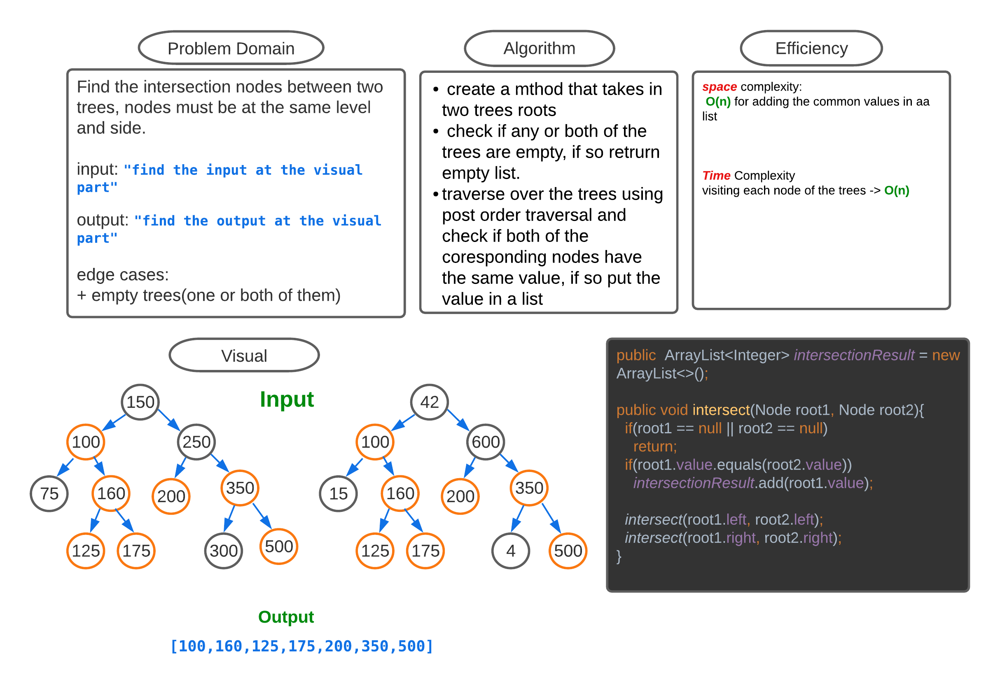

## Challenge_32
<!-- Description of the challenge -->
find the intersect nodes of two trees

traverse over the two trees using post order traversal and check if the both corresponding nodes have the same value.

## Whiteboard Process
<!-- Embedded whiteboard image -->

## Approach & Efficiency
<!-- What approach did you take? Why? What is the Big O space/time for this approach? -->
**space** complexity:
 **O(n)** for adding the common values in aa list

**Time** Complexity
visiting each node of the trees -> **O(n)**

## Solution
<!-- Show how to run your code, and examples of it in action -->

find the code [here](TreeIntersection.java)

run sample code [here](IntersectionMain.java)

run the tests [here](TestTreeIntersection.java)
