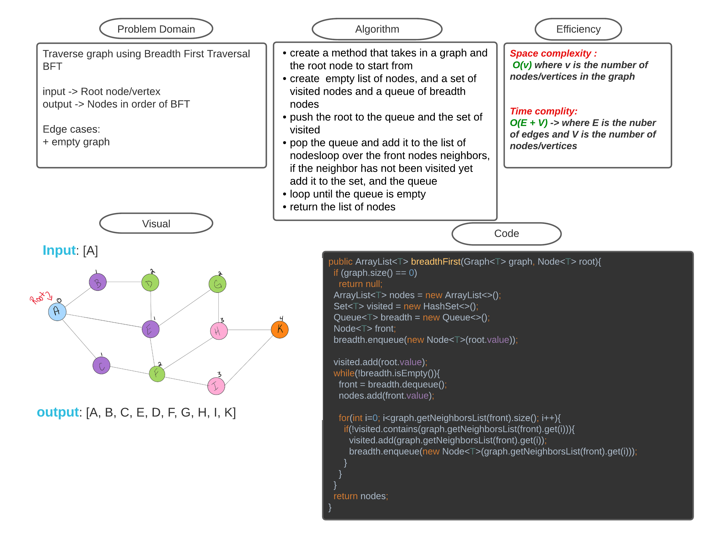

# Challenge Summary
<!-- Description of the challenge -->
Traverse graph using Breadth First Traversal BFT

input -> Root node/vertex
output -> Nodes in order of BFT

Edge cases:
+ empty graph

## Whiteboard Process
<!-- Embedded whiteboard image -->

## Approach & Efficiency
<!-- What approach did you take? Why? What is the Big O space/time for this approach? -->
Space complexity : 
 O(v) where v is the number of nodes/vertices in the graph

Time complity:
O(E + V) -> where E is the nuber of edges and V is the number of nodes/vertices

## Solution
<!-- Show how to run your code, and examples of it in action -->
Run the main function to see example of the code [here](Main.java)

Run the tests [here](TestBreadthFirst.java)