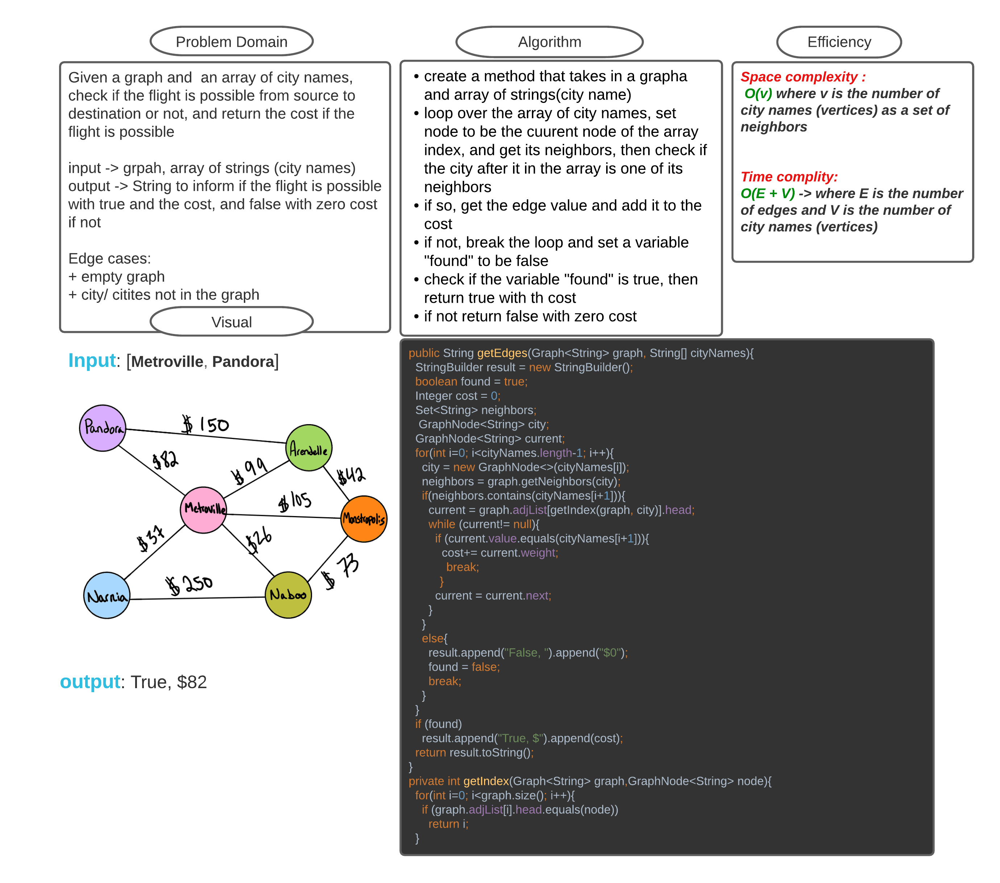

# Challenge Summary
<!-- Description of the challenge -->

Given a graph and  an array of city names, check if the flight is possible from source to destination or not, and return the cost if the flight is possible

input -> grpah, array of strings (city names)
output -> String to inform if the flight is possible with true and the cost, and false with zero cost if not

Edge cases:
+ empty graph
+ city/ citites not in the graph

Process

* create a method that takes in a grapha and array of strings(city name)
* loop over the array of city names, set node to be the cuurent node of the array index, and get its neighbors, then check if the city after it in the array is one of its neighbors
* if so, get the edge value and add it to the cost
* if not, break the loop and set a variable "found" to be false
* check if the variable "found" is true, then return true with th cost
* if not return false with zero cost

## Whiteboard Process
<!-- Embedded whiteboard image -->

## Approach & Efficiency
<!-- What approach did you take? Why? What is the Big O space/time for this approach? -->

Space complexity : 
 O(v) where v is the number of  city names (vertices) as a set of neighbors

Time complity:
O(E + V) -> where E is the number of edges and V is the number of city names (vertices)

## Solution
<!-- Show how to run your code, and examples of it in action -->

find the code [here](GetEdges.java)

run an example [here](MainGetEdges.java)

run the tests [here](TestGetEdges.java)
