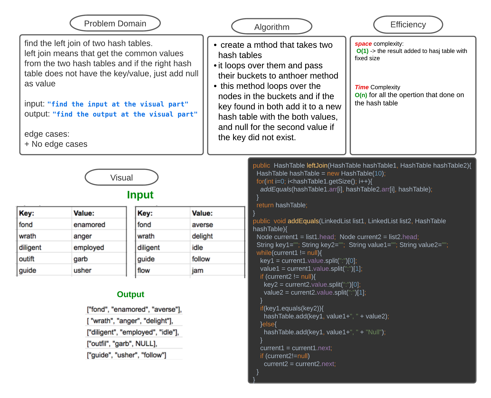

# Challenge_33 Hashmap LEFT JOIN 
<!-- Short summary or background information -->
left join on two hash tables return the left hash table keys/values with the other hash table values if the keys exist

if the key is not found in the second hash table a **Null** is added as the second value

## Challenge
<!-- Description of the challenge -->
 `leftJoin(HashTable <hashTable1>, HashTable<hashTable2>)` mthod that takes two hash tables and it loops over them and pass their buckets to anthoer method which is `addEquals()`

 `addEquals(LinkedList <list1>, LinkedList <list2>, HashTable <hashTable>)` this method loops over the nodes in the buckets and if the key found in both add it to the hash table with the both values, and null for the second value if the key did not exist.

 `hashTableBuckets(HashTable <hashTable>)` this method to print out the hash table left join result (**_empty buckets not included_**)

## Approach & Efficiency
<!-- What approach did you take? Why? What is the Big O space/time for this approach? -->
**space** complexity:
 **O(1)** -> the result added to hasj table with fixed size

**Time** Complexity
**O(n)** for all the opertion that done on the hash table

## Solution
<!-- Embedded whiteboard image -->
